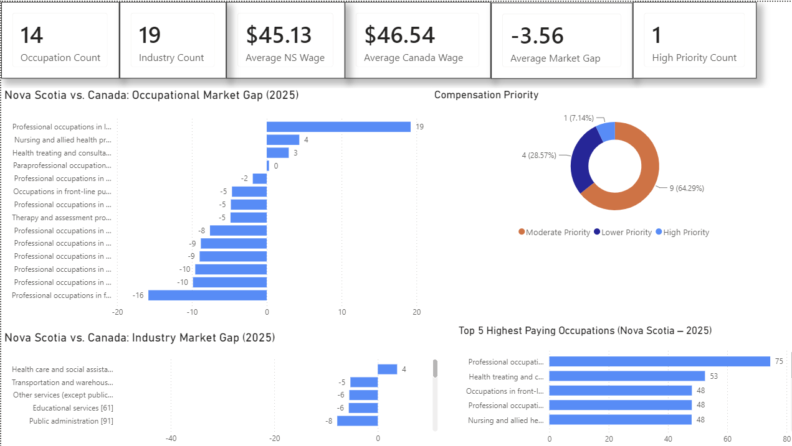

# Canadian Compensation Analysis Dashboard

### A Data Analytics Project using Python, SQL, and Power BI
## Project Overview
This project analyzes Canadian wage data published by Statistics Canada to evaluate compensation differences between Nova Scotia and the national labour market.

The project combines Python, SQL, and Power BI to clean, analyze, and visualize occupational and industry wage data. The analysis identifies compensation gaps, compares wage growth, and highlights occupations and industries requiring compensation review.

## Business Objectives
- Compare Nova Scotia wages with Canadian median wages.
- Identify occupations and industries with significant compensation gaps.
- Measure wage growth between 2015 and 2025.
- Classify occupations according to compensation priority.
- Build an interactive executive dashboard to support data-driven decision making.

  ## Dataset
  Source: Statistics Canada

Tables used:

- Table 14-10-0064-01 – Employee wages by occupation (NOC)
- Table 14-10-0417-01 – Employee wages by industry (NAICS)

Year analyzed:

- 2025
## Tools & Technologies
- Python
- Pandas
- NumPy
- SQLite
- SQL
- Jupyter Notebook
- Power BI
- Git
- GitHub

## Project Workflow
Raw Statistics Canada Data
            │
            ▼
Data Cleaning & Preparation (Python)
            │
            ▼
Exploratory Data Analysis (EDA)
            │
            ▼
Business Analysis (SQL)
            │
            ▼
Interactive Dashboard (Power BI)
            │
            ▼
Business Insights

## Repository Structure
Canadian-Compensation-Analysis
│
├── data
│   ├── raw
│   └── processed
│
├── notebooks
│
├── sql
│
├── powerbi
│
├── outputs
│
├── README.md
└── requirements.txt

## Executive Dashboard

## Key Insights
- Finance occupations in Nova Scotia earn approximately 16% less than the Canadian median.
- Legal occupations earn approximately 19% more than the Canadian median.
- Forestry, mining, and oil & gas industries show the largest compensation gap.
- Most occupations fall into the Moderate Priority compensation category.
- Health occupations remain among the highest-paid occupations in Nova Scotia.

## Skills Demonstrated
- Data Cleaning
- Data Wrangling
- Exploratory Data Analysis (EDA)
- SQL Query Development
- Statistical Analysis
- Business Intelligence
- Data Visualization
- Dashboard Design
- Power BI
- Git Version Control

## Future Improvements
- Expand the Power BI dashboard with additional analysis pages.
- Add drill-through and interactive report navigation.
- Include provincial trend analysis over time.
- Automate data refresh using Power Query.

## Author

Maryam Allahyar

GitHub: https://github.com/YOUR_USERNAME

LinkedIn: YOUR_LINKEDIN_URL
